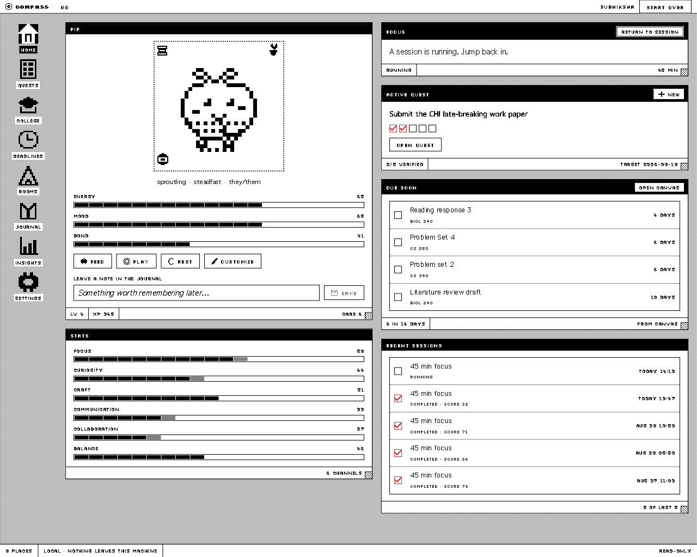
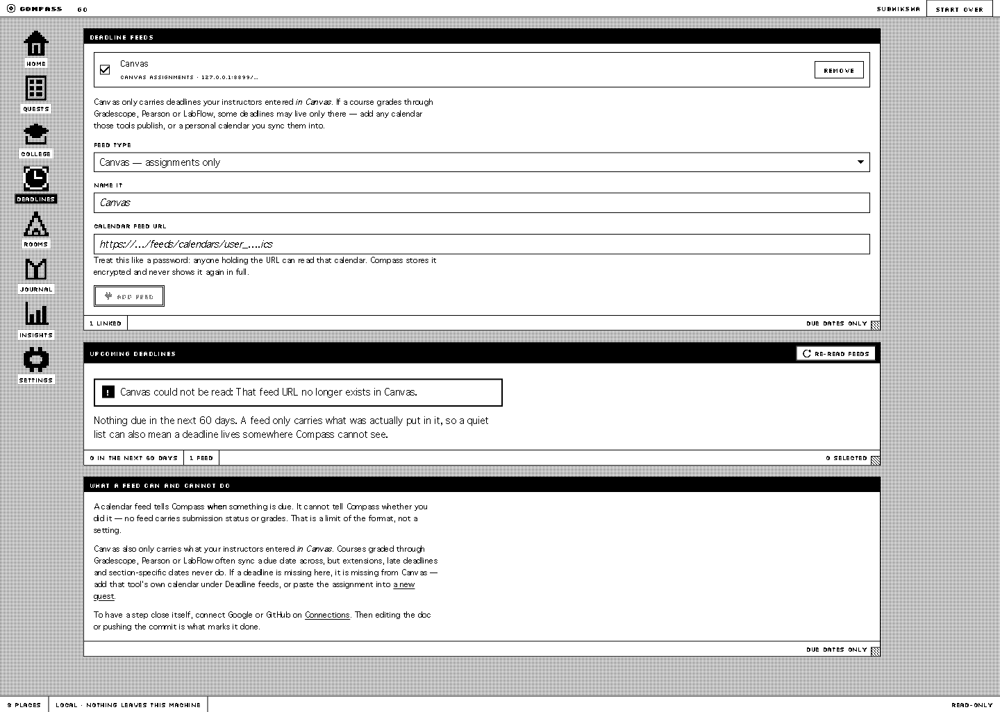
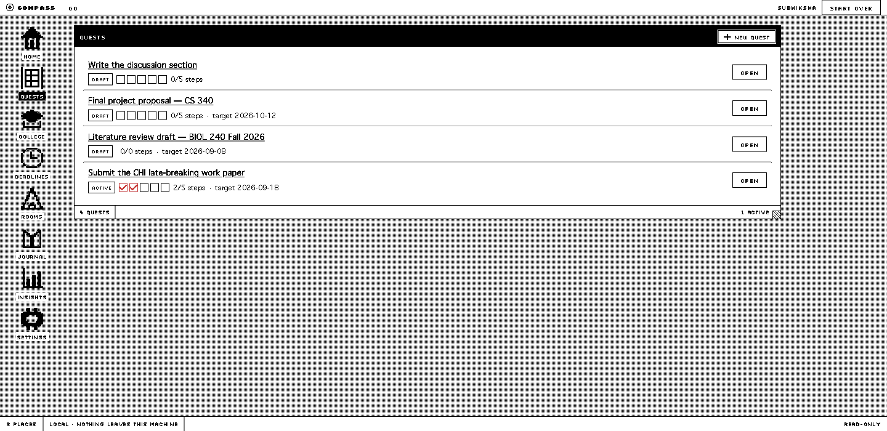
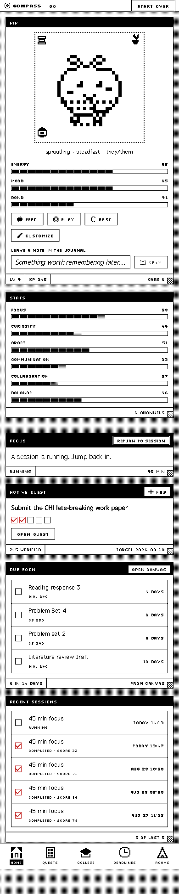

# Compass: Evidence-Verified Progress Tracking for Students

[](https://github.com/avidnerd/compass/actions/workflows/ci.yml)
[](LICENSE)
[](https://www.python.org/)
[](https://github.com/avidnerd/compass/releases)

Compass turns a semester goal into subgoals and checks each one against evidence read from the
student's own Google Workspace, GitHub and Canvas accounts. A step closes when Compass finds the
evidence: a file edited, an email sent, a commit pushed, a calendar block kept.

Everything runs locally. No hosted server, no third-party connector platform, no paid API calls.
Every model is re-verified as free at call time, and Compass falls back to local behaviour when
none qualifies. Account access is read-only.



Connected accounts are read through a read-only Apps Script Web App the user deploys in their own
Google account, plus a read-only GitHub token and any number of iCalendar feeds. The model proposes
plans using internal evidence enums and never sees connector names. Evidence extraction is plain
Python against the provider payloads.

| Deadlines | Quests |
|---|---|
|  |  |

## Setup

Compass installs as a Python package. With Python 3.11+ and Node:

```bash
uv tool install git+https://github.com/avidnerd/compass#subdirectory=backend
compass
```

`pipx` works the same way. Node is needed only when installing from source, which builds the web
interface. A wheel from [Releases](https://github.com/avidnerd/compass/releases) needs neither.

Without Python, download a binary from [Releases](https://github.com/avidnerd/compass/releases).
The binaries are unsigned, so macOS and Windows warn on first run. On macOS run
`chmod +x compass-macos-arm64` then right-click and choose Open. On Windows choose More info, then
Run anyway. On an Intel Mac use the wheel or run `make binary`.

No configuration is needed. The database and an encryption key are created on first run in the
platform data directory (`~/Library/Application Support/Compass`, `%LOCALAPPDATA%\Compass`, or
`$XDG_DATA_HOME/compass`). Run `compass --help` for `--port`, `--host`, `--data-dir` and
`--no-browser`.

## Quickstart

Run `compass` and complete onboarding. Connecting accounts is optional. Without it, Compass still
creates quests and runs focus sessions, and steps close on your own confirmation.

To turn on verification, open Settings, then Connections, and add your own free
[OpenRouter key](https://openrouter.ai/keys). Then connect at least one data source below. Create a
goal, review the subgoals and evidence plan, activate it, and run a focus session.

## Connecting Data Sources

Compass supports four sources. Each is independent, so connect only the ones you want.

Available sources:

- Google Workspace (Drive, Docs, Sheets, Slides, Gmail, Calendar)
- GitHub
- Canvas and other iCalendar feeds
- College OS

### Google Workspace

Deploy the read-only Apps Script bridge in your own Google account by following
[`college-os/bridge/README.md`](college-os/bridge/README.md). Paste the deployment URL and token
into Settings, then Connections. The manifest requests only `*.readonly` scopes, so Google's
authorisation layer enforces read-only access rather than application code.

### GitHub

Create a read-only personal access token and paste it into Settings, then Connections.

### Canvas and other iCalendar feeds

1. In Canvas, open Calendar, click Calendar Feed, and copy the link.
2. Paste it into Deadlines, then Deadline feeds, with type `Canvas`.
3. Import assignments as quests with their real due dates.

Institutions restrict Canvas student access tokens, and OAuth needs an institutional developer key,
so the calendar feed is the only self-serve path. Courses graded through Gradescope, Pearson or
LabFlow may hold deadlines Canvas never receives. Add those calendars as extra feeds with type
`Other`. Feeds carry due dates, not proof of completion.

### College OS

[`college-os/`](college-os/README.md) provisions a Google Workspace structure: a `COLLEGE` Drive
tree, a `COLLEGE DASHBOARD` spreadsheet, calendars, Tasks lists and a Gmail label tree. Open
College in the sidebar and press Detect.

| College OS | becomes in Compass |
|---|---|
| `SEMESTER GOALS` rows | quests, with the Metric as the acceptance criterion |
| `THIS WEEK` area goals and Big 3 | quests targeted at the coming Sunday |
| `OPPORTUNITIES` | a pipeline view; open rows are importable as quests |
| the sheet's `Evidence` column | the evidence specs checked after a focus session |
| `WEEKLY REVIEWS` | outcome mix, failure diagnosis, evidence-citation rate |
| `TIME LOG` | per-category estimate multipliers, shown at 3 or more samples |

Imports are idempotent, so a row that already became a quest is never imported twice. An `Evidence`
cell Compass cannot observe falls back to manual confirmation.

## How It Works

1. **Profiles.** Each browser gets a local profile with its own credentials, an HttpOnly session
   cookie (only hashes are stored), and a one-time recovery code.
2. **Quests.** A goal becomes 3 to 7 editable subgoals, each with an acceptance criterion and an
   evidence plan drawn from internal enums.
3. **Focus sessions.** The server owns all timing. With one explicit browser screen-share, Compass
   samples still frames during active work and builds a separate attention view. Frames live in a
   temporary directory and are deleted after analysis. There is no audio, camera, keystroke or
   clipboard capture.
4. **Verification.** Finishing refreshes each required provider once, extracts evidence, and asks a
   free model whether the subgoal is complete. A score of 0.50 or above verifies it, 0.35 or below
   marks it incomplete, and anything between leaves the decision to the user. An evidence card
   shows what was found in every case.
5. **Rewards.** A focus score computed against the user's own recent baseline, with idempotent XP,
   care points and stats. There are no streaks, leaderboards or penalties for time away.

## Development

```bash
cp .env.example .env   # optional; env keys still work in a checkout
make setup             # venv + backend deps + npm install
make migrate           # apply SQLite migrations
make dev               # FastAPI (:8000) + Vite (:5173)
```

A source checkout keeps its database and secret in `backend/`. For a single-process release build:

```bash
make build             # lint, typecheck, test, build the SPA
make serve             # FastAPI serves SPA + API + WebSocket on :8000
```

`make test` runs the backend suite (125 tests, all offline; the data provider and OpenRouter are
mocked at the transport layer) plus the frontend typecheck and lint. CI runs the same on every push.

### Environment (.env at the workspace root)

| Variable | Required | Purpose |
|---|---|---|
| `OPENROUTER_API_KEY` | no | Fallback when no per-profile key is set. Used only for verified-free models |
| `COMPASS_APP_SECRET` | no | Generated on first run if unset. Derives the key encrypting stored credentials |
| `COMPASS_BRIDGE_URL` / `COMPASS_BRIDGE_TOKEN` | no | Apps Script bridge deployment; settable per profile instead |
| `COMPASS_GITHUB_TOKEN` | no | Read-only GitHub PAT |
| `COMPASS_DRIVE_OWNED_ONLY` | no | Restrict Drive reads to files you own |
| `OPENROUTER_MODEL` / `OPENROUTER_FALLBACK_MODELS` | no | Preference order; every candidate re-verified as free at runtime |
| `COMPASS_BIND_HOST`, `COMPASS_PUBLIC_MODE`, `COMPASS_FRONTEND_ORIGIN` | no | Default binding is `127.0.0.1` |
| `COMPASS_DATA_DIR`, `COMPASS_DB_PATH` | no | Override where the database and secret live |
| `COMPASS_DEMO_MODE` | no | Enables 1-minute demo focus sessions |

### Building distributables

```bash
make package    # -> backend/dist/*.whl     installable wheel
make binary     # -> backend/dist/compass   standalone executable
```

Tagging `v*` builds both for macOS (Apple Silicon), Linux and Windows in CI, smoke-tests each
binary by starting it, and publishes a release.

## Architecture

**Free-only LLM gateway.** All model calls pass through one function. A model qualifies only if its
id ends in `:free`, it reports zero prompt and completion pricing, and it advertises structured
outputs. These are checked against the live catalogue on every call, not read from config. Unknown
pricing disqualifies a model. There is no paid fallback.

**Deterministic evidence.** The model proposes plans using internal evidence enums and never sees
connector names or tool signatures. Extraction is plain Python against provider payloads. Evidence
types Compass cannot observe fall back to manual confirmation. Connected content is delimited as
untrusted input.

**Concurrency.** Verification is reachable from a timer, a user action and a job worker at the same
time. Tests drive these paths concurrently and assert exactly-once resolution, because the failure
mode here is silent double-crediting rather than a visible error.

**Design system.** A one-bit interface: two inks, ordered dither patterns in place of greys, and 50
hand-authored 12x12 pixel icons. Categories are distinguished by pattern, not hue, which also works
for colour-blind users. See [DESIGN.md](DESIGN.md).

**Packaging.** Compass opens the system browser instead of bundling a webview, because focus
monitoring needs `getDisplayMedia` and embedded webviews do not support it consistently.

**Stack.** Python, FastAPI, Pydantic, httpx, aiosqlite and Uvicorn on the backend. React,
TypeScript, Vite and TanStack Query on the frontend. One SQLite database (WAL) with numbered
migrations.

<details>
<summary>Mobile layout</summary>



</details>

## Privacy

- All persistence is one local SQLite file. Delete it and everything is gone.
- Raw file content is never written to disk, logs, caches or job records.
- Focus screenshots are temporary local files, never SQLite records or LLM-cache entries, and are
  deleted after analysis, cancellation or crash recovery.
- Sensitive-attribute inference is forbidden in every prompt.
- Settings, then Privacy, offers JSON export, memory deletion, cache deletion and profile deletion.
- A write-verb denylist plus a read allowlist means Compass cannot create, send, update or delete
  anything in a connected account.

## Troubleshooting

- **"Free AI temporarily unavailable".** No catalogue model passed verification, or the OpenRouter
  key was rejected. Check Settings, Connections, Free AI status. Compass continues with local
  fallbacks: filename-based interest tags, manual quest plans, human-confirmed verification. It
  does not switch to a paid model.
- **Connector shows `disconnected`.** Check the bridge card in Settings, then Connections.
  `bridge_not_public` means the Web App was not deployed with "Anyone" access. Statuses cache for
  5 minutes.
- **`google_meet` shows `unsupported`.** Expected. The Meet API needs a Google Cloud project, which
  this deployment model avoids.
- **Stale analytics badge.** The provider was unreachable, so cached data was served with a
  visible freshness label. Use the per-connector refresh, which has a 60 second cooldown.

## Reproducing the Verification Loop

1. Run `make serve`, then open Settings, Connections to confirm connector status and the active
   free model.
2. Complete onboarding and create a goal. Review the subgoals and evidence plan, both editable
   before activation.
3. Start a 1-minute session, make a real change in a connected app, and finish. Compass refreshes
   only the required providers, extracts evidence, and shows what it found.
4. Repeat step 3 without doing the work. The subgoal stays open and the evidence card explains why.
5. Open Deadlines, add a Canvas Calendar Feed URL, and import an assignment.
6. Open a second browser profile and join a focus room with its six-character code.
7. Open Insights, then System, for cache savings, provider freshness and verification history.
8. Remove the OpenRouter key and repeat a finish. Compass falls back to local planning and human
   confirmation, and reports that free AI is unavailable.

## Attribution

Compass began as a hackathon project built with
[@justanotherinternetguy](https://github.com/justanotherinternetguy) and was later rebuilt as a
local-first application. Both authors are credited under the MIT licence. The original
specification is kept in [PLAN.md](PLAN.md), and durable product context in
[PRODUCT.md](PRODUCT.md).
